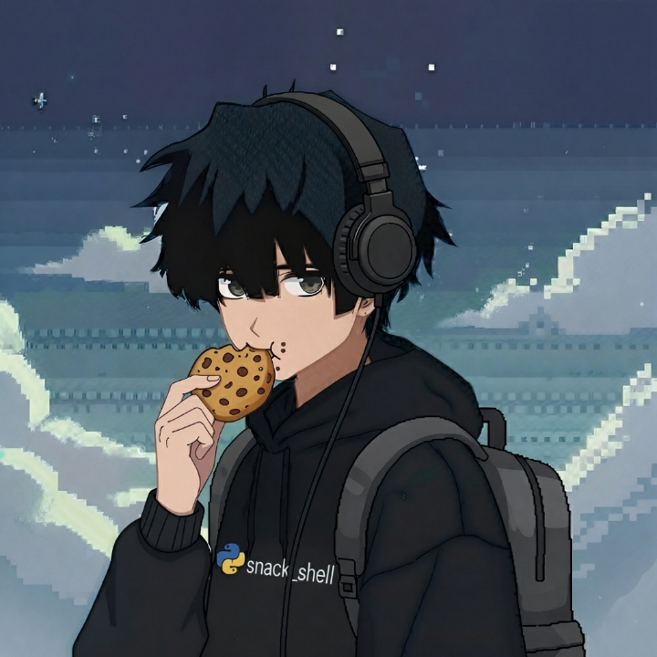

  

  
    

  

    
    
    
    
  

  

    <table border="0" cellpadding="0" cellspacing="0" width="100%">
      <tr>
        <td width="30%" valign="top" align="center" style="padding-right: 20px;">
          
        </td>
        <td width="70%" valign="top" style="color: #D8FFD8; font-size: 16px; line-height: 1.6;">
          <h2 style="color:#00FF88; margin-top: 0; padding-bottom: 5px; border-bottom: 2px solid #003321;">
            Hey! I’m SnackShell.
          </h2>
          

            I'm a self-taught <strong>AI & ML Engineer,</strong> currently focused on building <strong>SelamGPT</strong> — an LLM platform for Ethiopian languages.
          

          

            I'm a creative developer, vibe coder, and a strong advocate for <strong>open-source</strong>.
          

          

            Want to collaborate or just say hi? <a href="mailto:hello@snackshell.work" style="color: #00FF88; text-decoration:none; font-weight:bold;">Email Me.</a>
          

        </td>
      </tr>
    </table>
  

  

    <h3 style="color:#00FF88; margin-top:0; margin-bottom: 20px;">Stacks ⚡</h3>
    

      
    

  

  

    <h3 style="color:#00FF88; margin-top:0; margin-bottom: 20px;">GitHub Stats 📊</h3>
    <table border="0" cellpadding="10" cellspacing="0" width="100%">
      <tr>
        <td valign="top" width="50%">
          
        </td>
        <td valign="top" width="50%">
          
        </td>
      </tr>
      <tr>
        <td colspan="2" align="center" style="padding-top: 10px;">
          
        </td>
      </tr>
    </table>
  

  

    <h3 style="color:#00FF88; margin-top:0; margin-bottom: 20px;">snaky 🐍</h3>
    

      
    

  

  

    · · ·
  

  

   “𝘉𝘦 𝘢 𝘭𝘰𝘯𝘦𝘳. 𝘛𝘩𝘢𝘵 𝘨𝘪𝘷𝘦𝘴 𝘺𝘰𝘶 𝘵𝘪𝘮𝘦 𝘵𝘰 𝘸𝘰𝘯𝘥𝘦𝘳, 𝘵𝘰 𝘴𝘦𝘢𝘳𝘤𝘩 𝘧𝘰𝘳 𝘵𝘩𝘦 𝘵𝘳𝘶𝘵𝘩. 𝘏𝘢𝘷𝘦 𝘩𝘰𝘭𝘺 𝘤𝘶𝘳𝘪𝘰𝘴𝘪𝘵𝘺. 𝘔𝘢𝘬𝘦 𝘺𝘰𝘶𝘳 𝘭𝘪𝘧𝘦 𝘸𝘰𝘳𝘵𝘩 𝘭𝘪𝘷𝘪𝘯𝘨.”
  

